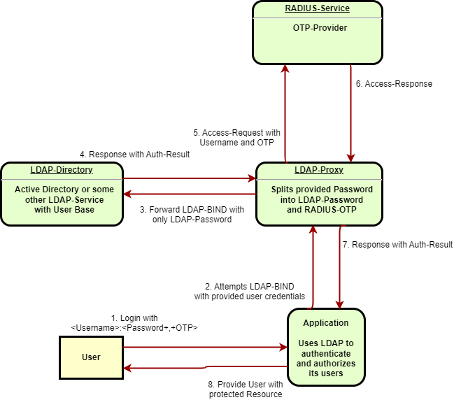

# LDAP Proxy

Intercept ldap bind requests and responses for adding a radius authentication as second factor.



## Usage

It is advised to run the application as a docker container. Follow the steps below to build and run the container.

```shell
# Checkout this repository
git clone https://github.com/martingegenleitner/ldap-proxy
cd ldap-proxy
# Build the image
docker build -t ldap-proxy .
# Create a container and expose its listening port on the docker host
docker run -p 8000:8000 ldap-proxy
```

Configuration of LDAP-Proxy is done by setting environment variables. Please take a look into the `.env` files in this repository to get examples for Active Directory and OpenLDAP. Environment variables can be set for the docker container by using the `-e` option on the `run` command. A docker-compose example can be found in the `tests` directory at [Docker-Compose Example](./tests/docker-compose.yml).

## Development

Initialize a virtual directory and install required packages using `pip`.
To use the `import ldap` follow the instructions at <https://www.python-ldap.org/en/python-ldap-3.3.0/installing.html#installing>.

```shell
git clone https://github.com/martingegenleitner/ldap-proxy
cd ldap-proxy
# initialize vEnv
python -m venv .venv
# Activate vEnv
./.venv/Scripts/activate(.bat)
# Install dependencies in vEnv
python -m pip install ldaptor
python -m pip install py-radius
python -m pip install python-ldap
```
